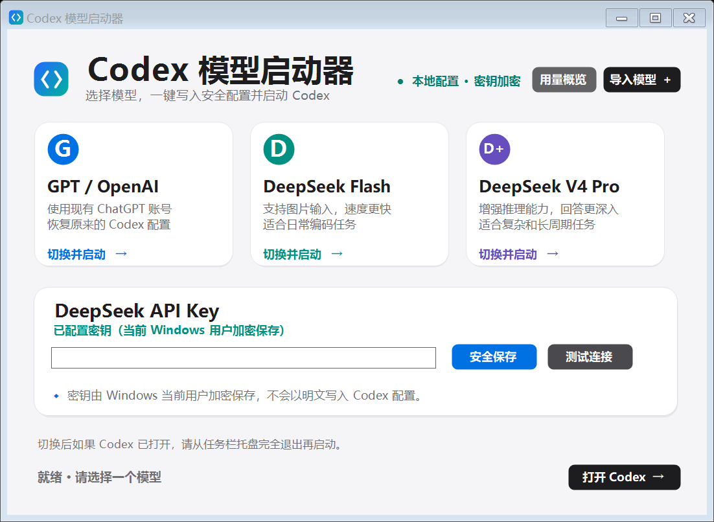
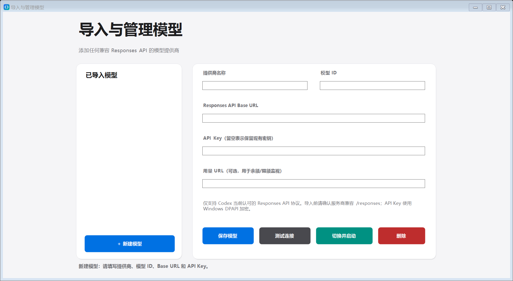
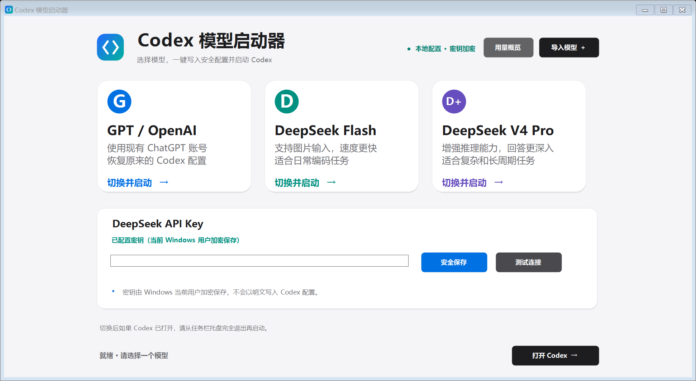

# Codex 模型启动器

A small Windows GUI launcher that switches the Codex desktop app between your ChatGPT account and third-party API providers such as DeepSeek.

Codex 桌面端可以在界面里切换模型，但要在「ChatGPT 账号登录」和「第三方 API Key」之间来回切换，只能手改 `%USERPROFILE%\.codex\config.toml`。这个小工具把这件事变成点一下卡片：写入安全配置、备份原配置、然后打开 Codex。

当前版本：1.5

## 功能

- **GPT / OpenAI**：恢复切换前的原始配置，继续使用已有的 ChatGPT 账号登录缓存（不会要求重新登录）。
- **DeepSeek Flash / DeepSeek V4 Pro**：写入 DeepSeek Responses API 提供商配置，API Key 加密保存。
- **导入模型**：任何兼容 Responses API 的服务都能加进来，可保存、编辑、删除、测试和切换。
- **用量概览**：每 5 分钟刷新。DeepSeek 显示账户余额；GPT 行通过官方 `codex app-server` 的只读 RPC 显示套餐类型、5 小时窗口、每周窗口的剩余百分比和重置时间。
- **安全**：API Key 用 Windows DPAPI 加密，只以密文存放；`config.toml` 里不会出现明文密钥。
- **可回退**：每次切换前自动备份 `config.toml`，随时可以切回 GPT 配置；MCP、项目信任等无关设置会被完整保留。
- **响应式界面**：接近 Apple 的浅色设计，窗口可缩放和最大化，放大时卡片、字体、按钮等比放大并保持居中。

## 界面

主界面：



导入与管理模型：



最大化时的等比缩放：



## 快速开始

下载 Release 中的压缩包，解压后双击 `CodexModelSwitcher.exe`。这是本地编译、未做商业代码签名的程序，Windows 第一次运行可能弹出安全提示。

使用步骤：

1. 在下方输入 DeepSeek API Key，点击「安全保存」。
2. 点击 DeepSeek Flash 或 DeepSeek V4 Pro 卡片。
3. 如果 Codex 已在运行，请从任务栏托盘右键 ChatGPT 选择 **Quit** 完全退出，再点击启动器中的「打开 Codex」——模型提供商配置只在 Codex 启动时读取。
4. 点击 GPT / OpenAI 卡片即可恢复切换前的配置和 ChatGPT 账号模式。

## 导入更多模型

1. 点击右上角「导入模型 +」。
2. 填写提供商名称、模型 ID、Responses API Base URL 和 API Key。
3. 如果服务商提供余额或限额查询地址，可填写「用量 URL」。
4. 点击「测试连接」，然后「切换并启动」。

Codex 当前对自定义提供商只支持 Responses API 协议（旧版的 `wire_api = "chat"` 已被官方移除），因此只能导入兼容 `/responses` 的服务。仅提供 `/chat/completions` 的接口无法直接接入，需要额外的协议转换层。导入模型使用 `cms_` 前缀的独立提供商 ID，不会覆盖手工配置的其他提供商。

## 工作原理

切换时，启动器只在 `config.toml` 顶部维护一个受标记管理的区块，其余内容原样保留：

```toml
# >>> Codex Model Switcher managed settings
model = "deepseek-flash"
model_provider = "deepseek"
preferred_auth_method = "apikey"
forced_login_method = "api"
model_reasoning_effort = "high"
web_search = "disabled"
model_catalog_json = "C:/Users/<you>/AppData/Roaming/CodexModelSwitcher/deepseek-models.json"
# <<< Codex Model Switcher managed settings

[model_providers.deepseek]
name = "DeepSeek"
base_url = "https://api.deepseek.com/"
wire_api = "responses"

[model_providers.deepseek.auth]
command = "C:/path/to/CodexModelSwitcher.exe"
args = ["--print-secret", "deepseek"]
```

密钥不写在配置文件里。Codex 需要凭据时会执行上面的命令，启动器解密后把密钥写到标准输出，因此配置文件里只有一段取密钥的命令。

GPT 用量来自本机官方 `codex app-server`：启动它、完成 `initialize` 握手，然后调用只读的 `account/rateLimits/read`，读取 `usedPercent`、`windowDurationMins`、`resetsAt` 和 `planType`。启动器不读取浏览器 Cookie，也不复制或显示 OAuth Token。

## 用量监视的边界

- DeepSeek Flash 和 DeepSeek V4 Pro 使用同一个 DeepSeek API 账户，显示的是共享余额，不是两个独立额度。
- GPT 限额只有在配置处于 GPT / OpenAI 模式时才能读取。切换到 DeepSeek 或导入模型后，`config.toml` 会被写入 `forced_login_method = "api"`，Codex 不再持有 ChatGPT 登录态，用量页的 GPT 行会显示读取失败——这是预期行为，切回 GPT 卡片即可恢复。
- GPT 用量需要本机已安装 Codex，且 ChatGPT 登录仍然有效。
- 导入的模型只有在服务商提供并配置了用量 URL 时才能读取；不同服务商返回格式不同，当前版本直接显示其精简响应。

## 安全与恢复

- API Key 使用 Windows DPAPI（`DataProtectionScope.CurrentUser`）加密，只有当前 Windows 用户能解密。
- 密钥不会以明文写入 `config.toml`。
- 每次切换前都会在 `%APPDATA%\CodexModelSwitcher\backups` 创建配置备份。
- 启动器只管理模型、提供商、认证方式、推理等级、Web 搜索和模型目录相关字段；MCP、项目信任和其他设置保持不变。
- 启动器不发送任何遥测。除了查询 DeepSeek 余额、拉取 DeepSeek 官方模型目录，以及与 OpenAI 官方文档中列出的第三方用量接口通信外，不会产生其他网络请求。

## 已知限制

- 需要 Codex 桌面端已在 Windows 上安装并至少启动过一次。
- 切换配置后必须完全退出并重新打开 Codex，配置才会生效。
- 只支持兼容 Responses API 的第三方服务。
- 启动器自身的移动或改名会导致 `config.toml` 中的取密钥命令失效，需要重新切换一次以刷新路径。
- 发布版 EXE 未做代码签名。

## 从源码构建

仓库只包含单个 `.cs` 源文件和构建脚本，用 Windows 自带的 .NET Framework 编译器即可编译，不需要安装 Visual Studio 或 .NET SDK：

```powershell
pwsh -File .\build.ps1
```

脚本会生成应用图标、编译带图标和高 DPI manifest 的 `CodexModelSwitcher.exe`，输出到 `dist/`，并运行程序内置的自测。

手动编译（不含图标和 manifest）：

```powershell
& "$env:WINDIR\Microsoft.NET\Framework64\v4.0.30319\csc.exe" /nologo /target:winexe /optimize+ /platform:anycpu /reference:System.dll /reference:System.Core.dll /reference:System.Drawing.dll /reference:System.Security.dll /reference:System.Windows.Forms.dll /out:CodexModelSwitcher.exe CodexModelSwitcher.cs
```

`CodexModelSwitcher.cs` 里包含界面、密钥加密、配置切换、备份恢复、用量读取和启动逻辑；`build/IconGenerator.cs` 只负责生成图标。

内置自测（会在临时目录里完整跑一遍切换与恢复，不触碰真实配置）：

```powershell
.\dist\CodexModelSwitcher.exe --self-test
```

## 文件位置

- Codex 配置：`%USERPROFILE%\.codex\config.toml`
- 加密密钥、模型列表与备份：`%APPDATA%\CodexModelSwitcher`

## 环境

- Windows 10 / 11（x64）
- Codex 桌面端（开发与实测基于 0.154.0-alpha.6.2）
- 无需管理员权限，无需额外运行时

## 实测情况

在 Windows 上用本机 Codex 实测：GPT / OpenAI 模式下，用量页显示的套餐类型、5 小时窗口与每周窗口的剩余百分比和重置时间，与官方 `codex app-server` 返回的原始数据一致；切到 DeepSeek 后同一界面能读到 DeepSeek 账户余额，切回 GPT 卡片后原配置和推理等级均正确恢复。自测覆盖配置切换、恢复、密钥不落明文和限额解析。

## 致谢

参考了 OpenAI 官方 Codex 文档中关于自定义模型提供商和 `codex app-server` 的说明，以及 DeepSeek 官方的 Codex 接入配置。

## 许可证

[MIT](LICENSE)
